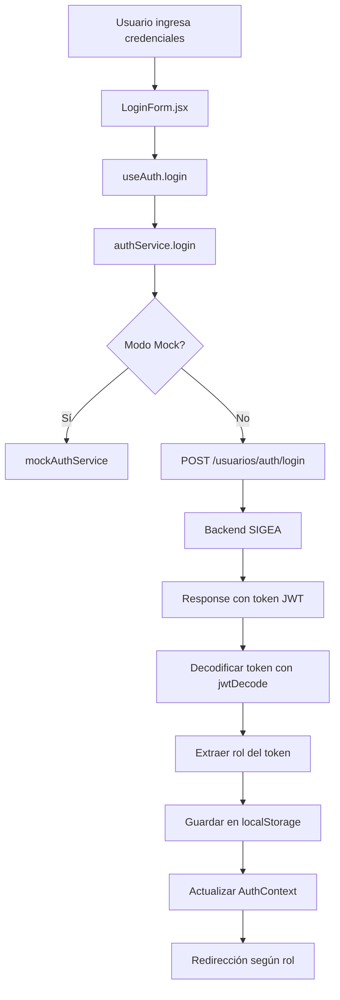
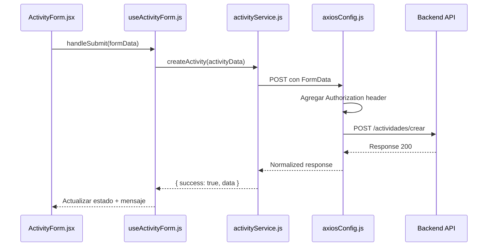
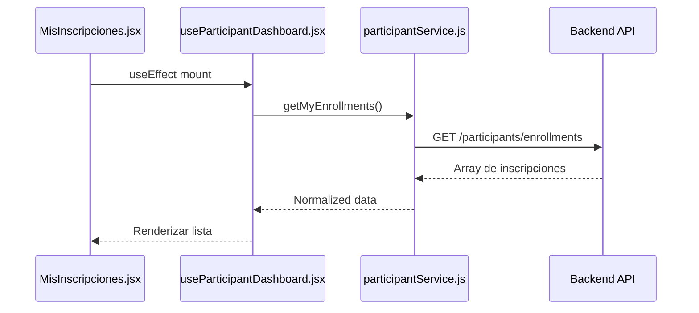

# 📊 Mapeo Completo del Proyecto SIGEA-frontend

## 🎯 Descripción General

**SIGEA** (Sistema Integral de Gestión de Eventos Académicos) es una aplicación web frontend desarrollada en React que consume una API REST del backend. El sistema permite gestionar eventos académicos, inscripciones, asistencias y certificados digitales.

---

## 🛠️ Stack Tecnológico

### Core
- **React** 18+ con Hooks
- **React Router DOM** v6 - Navegación y routing
- **Vite** - Build tool y dev server

### Gestión de Estado
- **Context API** - Estado global de autenticación
- **Custom Hooks** - Lógica reutilizable por feature

### HTTP Client
- **Axios** - Peticiones HTTP con interceptores
- **JWT Decode** - Decodificación de tokens JWT

### Estilos
- **CSS Modules** - Estilos con scope local
- **Vanilla CSS** - Sistema de diseño custom

---

## 📁 Estructura del Proyecto

### Punto de Entrada
```
src/index.jsx
  └─> App.jsx (envuelto en BrowserRouter)
      └─> AuthProvider (Context de autenticación)
          └─> AppRouter (Manejo de rutas)
```

### Directorios Principales

#### `/src/config/`
- **`api.config.js`**: Configuración centralizada de endpoints y URLs base

#### `/src/services/`
Capa de servicios que consume la API REST:
- **`axiosConfig.js`**: Cliente Axios configurado con interceptores
- **`authService.js`**: Login, registro, recuperación de contraseña
- **`activityService.js`**: CRUD de actividades, asistencias, certificados
- **`participantService.js`**: Inscripciones, pagos, certificados del participante
- **`eventsService.js`**: Eventos públicos

#### `/src/features/`
Organización por características (feature-based):

##### **auth/**
- `hooks/useAuth.jsx` - Context provider de autenticación
- `hooks/useAuthForm.jsx` - Lógica de formularios
- `components/LoginForm.jsx` - Formulario de login
- `components/RegisterForm.jsx` - Formulario de registro
- `components/PasswordRecovery/` - Flujo de recuperación de contraseña

##### **dashboard/**
- `components/DashboardLayout.jsx` - Layout reutilizable para dashboards
- `components/Sidebar.jsx` - Navegación lateral
- `config/organizerDashboardConfig.js` - Configuración del dashboard organizador
- `config/participantDashboardConfig.js` - Configuración del dashboard participante

##### **activities/**
- `hooks/useActivities.js` - Gestión de actividades
- `hooks/useActivityForm.js` - Formulario de creación/edición
- `hooks/useActivityManager.js` - Gestión completa de actividad
- `components/ActivityManager.jsx` - Vista principal de gestión
- `components/ActivityForm/` - Formulario multi-paso
- `components/ReportsModal/` - Subida de documentación

##### **participantsmanagement/**
- `hooks/useParticipantManager.js` - Gestión de participantes
- `components/ParticipantManager.jsx` - Vista principal
- `components/ParticipantList.jsx` - Lista de participantes
- `components/PaymentVerification/` - Verificación de pagos

##### **participantsDashboard/**
- `hooks/useParticipantDashboard.jsx` - Lógica del dashboard
- `components/EventosDisponibles.jsx` - Listado de eventos
- `components/MisInscripciones.jsx` - Inscripciones del usuario
- `components/MisCertificados.jsx` - Certificados obtenidos
- `components/EnrollmentForm.jsx` - Formulario de inscripción
- `components/PaymentUI.jsx` - Interfaz de pago

##### **certificates/**
- `hooks/useCertificates.js` - Gestión de certificados
- `components/CertificateManager.jsx` - Vista principal
- `components/CertificateList.jsx` - Lista de certificados
- `components/IssuanceStats.jsx` - Estadísticas de emisión

##### **landing/**
- `hooks/useLanding.js` - Datos de landing page
- `components/heroSection.jsx` - Sección hero
- `components/programsSection.jsx` - Programas disponibles
- `components/certificationsSection.jsx` - Certificaciones
- `components/reviewsSection.jsx` - Testimonios
- `components/aboutSection.jsx` - Acerca de
- `components/nextEventSection.jsx` - Próximo evento

#### `/src/desingSystem/` ⚠️ (typo: debería ser `designSystem`)
Sistema de diseño modular:

##### **tokens/**
- `colors.js` - Paleta de colores
- `typography.js` - Tipografía
- `spacing.js` - Espaciado
- `shadows.js` - Sombras
- `breakpoints.js` - Responsive breakpoints

##### **primitives/**
Componentes base reutilizables:
- `button/` - Botones
- `input/` - Inputs
- `card/` - Tarjetas
- `badge/` - Badges
- `avatar/` - Avatares
- `icon/` - Iconos
- `divider/` - Divisores
- `skeleton/` - Skeletons de carga
- `spinner/` - Spinners
- `typography/` - Componentes de texto

#### `/src/pages/`
Páginas principales:
- **`LandingPage.jsx`** - Página de inicio pública
- **`Auth.jsx`** - Login/Registro
- **`ValidationPage.jsx`** - Validación de certificados
- **`EventsPage.jsx`** - Listado de eventos públicos
- **`ParticipantDashboard.jsx`** - Dashboard del participante
- **`OrganizerActivity.jsx`** - Dashboard del organizador
- **`AdminDashboard.jsx`** - Dashboard del administrador
- **`DesignSystemTest.jsx`** - Testing del design system (dev only)

#### `/src/utils/`
Utilidades:
- `apiHelpers.js` - Normalización de respuestas
- `errorHandler.js` - Manejo centralizado de errores
- `tokenHelper.js` - Helpers para tokens
- `constants.js` - Constantes globales
- `themeHelpers.js` - Helpers de tema

---

## 🔐 Sistema de Autenticación

### Flujo de Login



### Tokens y Almacenamiento

**localStorage:**
- `authToken` - JWT token de acceso
- `refreshToken` - Token de refresco
- `user` - Objeto de usuario serializado
- `userRole` - Rol del usuario
- `userEmail` - Email del usuario
- `tokenTimestamp` - Timestamp de creación del token

### Interceptores de Axios

**Request Interceptor:**
- Agrega `Authorization: Bearer <token>` a cada petición
- Logs de desarrollo (si `VITE_ENABLE_LOGS=true`)

**Response Interceptor:**
- Detecta errores 401 (no autorizado)
- Intenta refresh automático del token
- Maneja cola de peticiones fallidas durante refresh
- Redirige a `/auth` si el refresh falla
- Limpia localStorage en caso de error

---

## 🌐 Configuración de API

### Variables de Entorno (.env)

```bash
VITE_API_URL=http://localhost:8080/api/v1
VITE_API_TIMEOUT=30000
VITE_USE_MOCK_API=false
VITE_ENABLE_LOGS=true
```

### Endpoints Principales

#### Autenticación
```
POST /usuarios/auth/login
POST /usuarios/participante/registrar
POST /usuarios/administrador/auth/register
POST /usuarios/auth/refresh
POST /usuarios/auth/logout
```

#### Usuarios
```
GET  /usuarios/perfil
PUT  /usuarios/perfil
GET  /usuarios/participante/home
GET  /usuarios/organizador/home
GET  /usuarios/organizador/dashboard
GET  /usuarios/administrador/home
```

#### Actividades
```
GET    /actividades/listar
POST   /actividades/crear
PUT    /actividades/actualizar
DELETE /actividades/eliminar
```

#### Inscripciones
```
POST /usuarios/participante/inscripcion
```

#### Asistencia
```
POST /usuarios/organizador/registrar-asistencia
```

---

## 🛣️ Sistema de Routing

### Tipos de Rutas

#### **Rutas Públicas** (sin autenticación)
```javascript
/                  → LandingPage
/events            → EventsPage
/validation        → ValidationPage
/design-system     → DesignSystemTest (dev only)
```

#### **Rutas de Autenticación**
```javascript
/auth              → AuthPage (Login/Registro)
```

#### **Rutas Privadas** (requieren autenticación + rol)

**Participante:**
```javascript
/participant/*     → ParticipantDashboard
  ├─ /dashboard    → Inicio
  ├─ /events       → Eventos disponibles
  ├─ /enrollments  → Mis inscripciones
  └─ /certificates → Mis certificados
```

**Organizador:**
```javascript
/organizer/*       → OrganizerActivity
  ├─ /dashboard    → Inicio
  ├─ /activities   → Gestión de actividades
  ├─ /participants → Gestión de participantes
  └─ /certificates → Emisión de certificados
```

**Administrador:**
```javascript
/admin/*           → AdminDashboard
  └─ /dashboard    → Panel administrativo
```

### Protección de Rutas

El componente `PrivateRoute` en `AppRouter.jsx`:
1. Verifica autenticación
2. Valida rol del usuario
3. Redirige a `/auth` si no está autenticado
4. Redirige al dashboard correcto si el rol no coincide

---

## 📊 Flujo de Datos

### Patrón de Arquitectura

```
Componente UI
    ↓
Custom Hook (useXXX)
    ↓
Service (XXXService)
    ↓
axiosConfig (interceptores)
    ↓
API REST Backend
```

### Ejemplo: Crear Actividad



### Ejemplo: Listar Inscripciones (Participante)



---

## 🔄 Gestión de Estado

### Context API - Autenticación

**AuthProvider** (`useAuth.jsx`):
- Estado global: `user`, `loading`, `isAuthenticated`
- Métodos: `login()`, `logout()`
- Persistencia en `localStorage`
- Validación de sesión al montar

### Custom Hooks por Feature

Cada feature tiene sus propios hooks para encapsular lógica:

- **`useActivities`** - Lista y elimina actividades
- **`useActivityForm`** - Formulario multi-paso de actividad
- **`useActivityManager`** - Gestión completa (tabs, filtros, modal)
- **`useParticipantManager`** - Gestión de participantes y asistencia
- **`useCertificates`** - Emisión y listado de certificados
- **`useParticipantDashboard`** - Dashboard del participante
- **`useLanding`** - Datos de landing page
- **`useAuth`** - Autenticación global
- **`useAuthForm`** - Formularios de auth

---

## 🎨 Sistema de Diseño

### Tokens de Diseño

**Colores:**
- Primarios, secundarios, acentos
- Estados (success, error, warning, info)
- Grises y neutros

**Tipografía:**
- Font families
- Font sizes (xs, sm, md, lg, xl, 2xl, etc.)
- Font weights
- Line heights

**Espaciado:**
- Sistema de 8px base
- Valores: xs, sm, md, lg, xl, 2xl, etc.

**Sombras:**
- Niveles de elevación (sm, md, lg, xl)

### Componentes Primitivos

Todos los primitivos siguen el patrón:
```
/primitives/[component]/
  ├─ [component].jsx  - Implementación
  └─ index.js         - Export
```

Uso:
```javascript
import { Button, Input, Card } from '@/desingSystem/primitives';
```

---

## 🔧 Modo Mock vs Producción

El sistema soporta dos modos de operación:

### Modo Mock (`VITE_USE_MOCK_API=true`)
- Datos simulados en los servicios
- Delays artificiales para simular red
- Útil para desarrollo sin backend

### Modo Producción (`VITE_USE_MOCK_API=false`)
- Consume API real del backend
- Manejo de errores real
- Interceptores activos

**Implementación en servicios:**
```javascript
if (USE_MOCK_API) {
  return mockService.mockMethod();
} else {
  const response = await apiClient.get('/endpoint');
  return normalizeResponse(response);
}
```

---

## 📦 Características Principales por Rol

### 👤 Participante
1. **Ver eventos disponibles** - Catálogo de actividades
2. **Inscribirse** - Formulario de inscripción
3. **Realizar pago** - Subir comprobante
4. **Ver mis inscripciones** - Estado de inscripciones
5. **Descargar certificados** - Certificados obtenidos
6. **Validar certificados** - Verificación online

### 👨‍🏫 Organizador
1. **Crear actividades** - Formulario multi-paso
2. **Gestionar actividades** - CRUD completo
3. **Gestionar participantes** - Lista por actividad
4. **Registrar asistencia** - Checkboxes por participante
5. **Verificar pagos** - Aprobar/rechazar comprobantes
6. **Emitir certificados** - Individual o masivo
7. **Subir documentación** - Propuestas, informes, evidencias

### 👨‍💼 Administrador
1. **Dashboard general** - Estadísticas globales
2. **Gestión de usuarios** - CRUD de usuarios
3. **Gestión de roles** - Asignación de permisos
4. **Reportes** - Generación de reportes

---

## 🚀 Comandos de Desarrollo

```bash
# Instalar dependencias
npm install

# Modo desarrollo
npm run dev

# Build producción
npm run build

# Preview build
npm run preview
```

---

## 🔍 Puntos Clave de Integración con Backend

### Headers Requeridos
```javascript
{
  'Authorization': 'Bearer <token>',
  'Content-Type': 'application/json',
  'Accept': 'application/json'
}
```

### Formato de Respuesta Esperado
```javascript
{
  status: boolean,
  message: string,
  data: any,
  extraData: {
    accessToken: string,
    Refresh_Token: string
  }
}
```

### Manejo de Errores
- **401** → Refresh token automático
- **403** → Acceso prohibido (log)
- **400/500** → Mensaje de error al usuario

### Estructura de Token JWT
```javascript
{
  usuarioId: string,
  roles: string[],  // ['participante'] | ['organizador'] | ['administrador']
  exp: number,
  iat: number
}
```

---

## 📝 Notas Importantes

1. **Error de ortografía**: El directorio `desingSystem` debería ser `designSystem`
2. **Modo Mock**: Útil para desarrollo, pero debe desactivarse en producción
3. **Refresh Token**: Implementado pero puede necesitar ajustes según backend
4. **Validación de Roles**: Case-insensitive, soporta variantes (admin/administrador)
5. **Lazy Loading**: Todas las páginas usan lazy loading para optimización
6. **CSS Modules**: Cada componente tiene su propio CSS con scope local

---

## 🎯 Próximos Pasos Sugeridos

1. Corregir typo: `desingSystem` → `designSystem`
2. Agregar tests unitarios para servicios
3. Implementar manejo de errores más robusto
4. Agregar loading states globales
5. Implementar cache de datos
6. Agregar validación de formularios más estricta
7. Implementar internacionalización (i18n)
8. Agregar analytics y tracking
